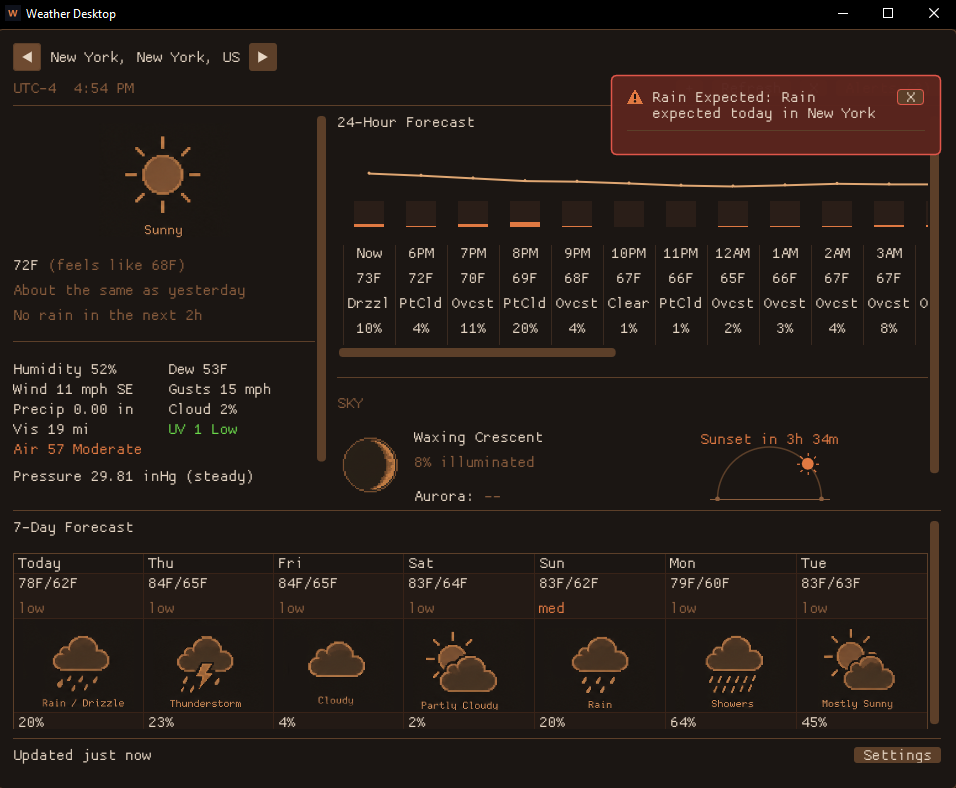

# Weather Desktop

A small, native **Windows weather app** for the desktop — current conditions, a
24-hour and 7-day forecast with pixel-art weather icons, official + derived
weather alerts, air quality, a minute-by-minute rain nowcast, and a "Sky" panel
with a sunrise→sunset arc, moon phase, aurora odds, and meteor showers. It lives
in the system tray and shows a quick-look card on hover.



Built with SDL2 + [Dear ImGui](https://github.com/ocornut/imgui) + OpenGL.
Weather, air quality and geocoding from [Open-Meteo](https://open-meteo.com/)
(no API key); official US alerts from the [NWS API](https://www.weather.gov/documentation/services-web-api);
aurora visibility from the free [NOAA SWPC](https://www.swpc.noaa.gov/) planetary
K-index feed.

## Features

- **Current conditions** — temperature, feels-like, humidity, dew point,
  wind/gusts, precipitation, cloud cover, visibility, UV index, **air quality**
  (US AQI), and barometric **pressure with a 3-hour rising/steady/falling
  tendency**.
- **Rain nowcast** — a minute-by-minute "rain starting/stopping in ~N min" line
  from Open-Meteo's 15-minute precipitation series.
- **Forecasts** — a 24-hour view with an aligned temperature/precip **trend
  chart** (hover any column for a per-hour breakdown including rain/snow
  amounts), and a 7-day outlook showing a **cross-model confidence** chip per day.
- **Alerts** — official **US NWS watches/warnings** plus locally-derived alerts
  (severe weather, temperature swings, rain/snow/hail, high wind, freezing
  precipitation), surfaced as floating toasts and OS notifications.
- **Notification scheduling** — deliver alerts as they happen, only outside quiet
  hours, or as a once-a-day digest; a notification center keeps the history.
- **Sky panel** — a **sunrise→sunset arc** with the sun at the current time and a
  contextual "Sunset/Sunrise in …" headline, the moon phase (with illumination),
  aurora chance for your latitude, and active meteor showers.
- **Tray quick-look** — hover the tray icon for a compact card (temp, condition,
  feels-like, high/low, wind, rain) without opening the window.
- **Locations** — search by city/zip, enter exact coordinates, or detect your
  location via the OS (Windows); °F/°C + mph/km-h, "vs yesterday" comparison,
  start-minimized, and a system-tray presence.

## Build (Windows, MSYS2 / mingw-w64)

Install the toolchain and dependencies:

```
pacman -S --needed \
    mingw-w64-x86_64-toolchain mingw-w64-x86_64-cmake mingw-w64-x86_64-ninja \
    mingw-w64-x86_64-SDL2 mingw-w64-x86_64-curl mingw-w64-x86_64-nlohmann-json
```

Then configure and build:

```
cmake -S . -B build -G Ninja -DCMAKE_BUILD_TYPE=Release
cmake --build build
```

The executable lands at `build/WeatherDesktop.exe`. The `resources/` folder
(font + sprite sheets) is copied next to it automatically; ship them together.

## Tests

A small zero-dependency unit-test runner covers the pure logic (forecast/AQI
parsing, alert rules, nowcast, sky events, unit conversions, the thread-safe
queue). It builds as a separate target and is wired into CTest:

```
cmake --build build --target wd_tests
ctest --test-dir build --output-on-failure
```

## Credits

- Font: **Kenney Space** ([kenney.nl](https://kenney.nl/), CC0).
- Weather and moon-phase sprite sheets © their author, included with the app.
- Weather / air quality: Open-Meteo. Official alerts: US NWS. Space weather: NOAA SWPC.

## License

MIT — see [LICENSE](LICENSE).
